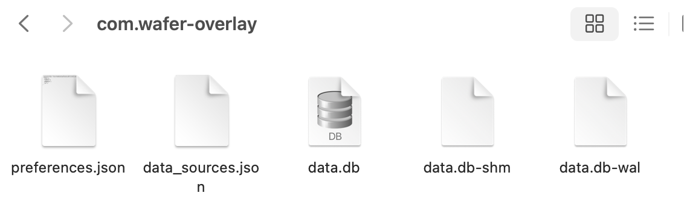

# Wafer Overlay (智能叠图)

> This was a built using [Tauri V2](https://v2.tauri.app/start/) with `yarn create tauri-app`.

**Development stack**
- [Tauri](https://v2.tauri.app/start/): Tauri + React + Typescript
- [Mantine](https://mantine.dev/): GUI library for React
- [ThreeJS](https://threejs.org/): JS-based 3D library for accurate drawing of wafers
- Rust Backend

**IDE setup:**

[VS Code](https://code.visualstudio.com/) + [Tauri](https://marketplace.visualstudio.com/items?itemName=tauri-apps.tauri-vscode) + [rust-analyzer](https://marketplace.visualstudio.com/items?itemName=rust-lang.rust-analyzer)

## Project structure

### Branches

### Folder structure

## Screenshots & demo

## Pre-compiled binaries

## Building

## Developer notes

### Creating icons

```
yarn tauri icon --help
yarn tauri icon public/logo3.png
```

### Building

#### Windows

```

```

#### MacOS
```
yarn tauri build --bundles dmg
```

### 文件夹与文件正则表达式

| 文件夹 | 正则表达式 |
| -------- | ------------------------------- |
| 衬底       | `(?<=[/\\])衬底(?=[/\\])`         |
| FAB CP   | `(?<=[/\\])FAB\s*CP(?=[/\\])`   |
| CP 1     | `(?<=[/\\])CP\s*1(?=[/\\])`     |
| WLBI MAP | `(?<=[/\\])WLBI\s*MAP(?=[/\\])` |
| CP 2     | `(?<=[/\\])CP\s*2(?=[/\\])`     |
| AOI      | `(?<=[/\\])AOI(?=[/\\])`        |

## Database \(数据库\)

The database file is located in the `%APPDATA` folder, named `data.db`.



### Admin password via env

- Set a default admin password by creating a `.env` file at the project root:
  - Copy `.env.example` to `.env`
  - Set `VITE_ADMIN_DEFAULT_PASSWORD=your-secret`
- On first run, if the database still has the seed password (`admin`), the app updates it to the env value during initialization.
- The “default password” check in the UI uses this env value as the baseline.


## References (libraries, dependencies, papers, etc.)

- https://www.sichainsemi.com/
- https://v2.tauri.app/start/
- https://react-redux.js.org/
- https://threejs.org/
- https://github.com/0xtaruhi/ufde-next/
- https://github.com/tabler/tabler-icons/

## Authors

- JUN WEI WANG | [jwwang2003](https://github.com/jwwang2003/)
- YI TING | [ee731](https://github.com/ee731)

## PyTorch / libtorch

### macOS ARM Tauri bundle (ship libtorch inside the .app)
- Download the official `libtorch-macos-arm64` zip from pytorch.org and unpack it into `src-tauri/libtorch/` so you have `src-tauri/libtorch/lib/libtorch.dylib`, `libtorch_cpu.dylib`, etc.
- `src-tauri/tauri.conf.json` already copies `libtorch/**` into the bundle; the dylibs land in `AOI Wafer Stacking.app/Contents/Resources/libtorch/lib`.
- If you built libtorch locally at `3rdparty/pytorch/build/install`, either copy or symlink it into place so the bundler sees it:
  ```
  ln -snf ../3rdparty/pytorch/build/install src-tauri/libtorch
  ```
- Build the macOS ARM bundle with the vendored libs:
  ```
  cd src-tauri
  LIBTORCH=./libtorch \  # or ../3rdparty/pytorch/build/install
  RUSTFLAGS="-C link-args=-Wl,-rpath,@executable_path/../Resources/libtorch/lib" \
  cargo tauri build --target aarch64-apple-darwin
  ```
  (You can swap `cargo tauri build` with `yarn tauri build`; add `LIBTORCH_BYPASS_VERSION_CHECK=1` if needed.)
- Verify the binary can see the libs:
  ```
  otool -l target/release/bundle/macos/AOI\ Wafer\ Stacking.app/Contents/MacOS/aoi-wafer-stacking | rg LC_RPATH
  ls target/release/bundle/macos/AOI\ Wafer\ Stacking.app/Contents/Resources/libtorch/lib
  ```
- If codesign complains, run from `src-tauri`: `codesign --force --deep --sign - target/release/bundle/macos/AOI\ Wafer\ Stacking.app`

### macOS dev using a Python-installed torch
In a shell before running `yarn tauri dev`:
```
export LIBTORCH_BYPASS_VERSION_CHECK=1
export LIBTORCH_USE_PYTORCH=1
torch_lib=$(python - <<'PY'
import torch, os
print(os.path.join(os.path.dirname(torch.__file__), 'lib'))
PY
)
echo "Using torch lib dir: $torch_lib"
ls "$torch_lib/libtorch_cpu.dylib"  # should exist
export LIBTORCH="$torch_lib"
export DYLD_LIBRARY_PATH="$torch_lib:${DYLD_LIBRARY_PATH}"
yarn tauri dev
```

### Building libtorch from source
Refer to [PyTorch's build-from-source guidelines](https://github.com/pytorch/pytorch?tab=readme-ov-file#installation). Tested on an M1 Pro (2023 MacBook 14").

```
git submodule init
git submodule update --recursive
```

```
cd 3rdparty/pytorch
export BUILD_TEST=0
export USE_DISTRIBUTED=0
export USE_CUDA=0
export USE_MPS=0   # set to 1 if you actually need MPS on macOS
export DEBUG=0
python tools/build_libtorch.py
```

```
mkdir -p build && cd build

cmake .. \
  -DCMAKE_BUILD_TYPE=Release \
  -DCMAKE_INSTALL_PREFIX="$PWD/install" \
  -DBUILD_SHARED_LIBS=ON \
  -DBUILD_PYTHON=OFF \
  -DBUILD_TEST=OFF \
  -DUSE_CUDA=OFF \
  -DUSE_MPS=OFF \
  -DUSE_DISTRIBUTED=OFF

cmake --build . --target install -j"$(sysctl -n hw.ncpu)"
```

```
ln -snf ../3rdparty/pytorch/build/install ../src-tauri/libtorch 
```


### Dev without libtorch:

```
yarn tauri dev -- -- --no-default-features
```