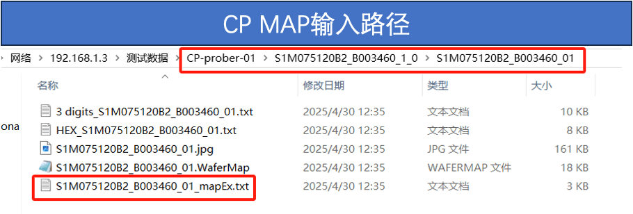
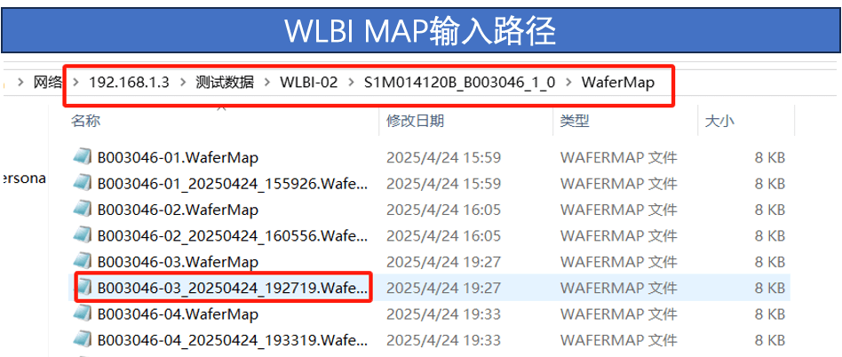
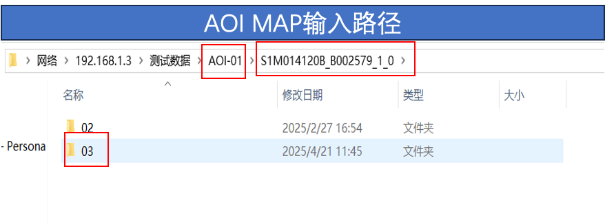
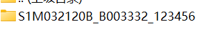
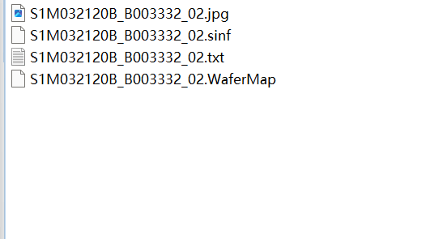
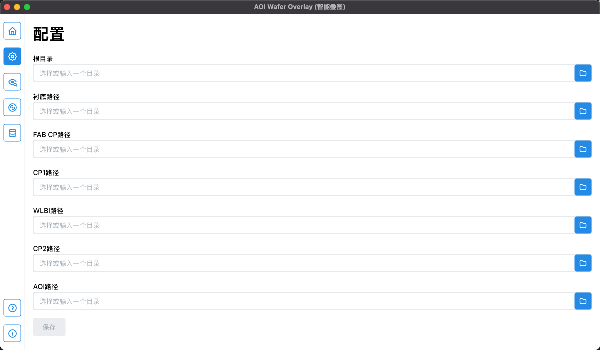
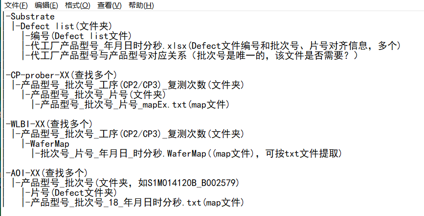

# 软件需求

## 输入要求

在一个跟目录下存在六个文件夹分别含有一下关键词：

- 衬底
- FAB, CP
- CP, 1
- WLBI
- CP, 2
- AOI (来自AOI程序的 .txt 输出)

> 以上也是叠图进行的顺序\(从上到下\)

**CP map 路径例子：**


**WLBI map 路径例子：**


**AOI map 路径例子：**


### 问题:

- **!!CP、WLBI、AOI的子路径结构都稍有不一样，如果要可靠的自动识别的话需要更具体的路径和命名结构描述**
- **!!自动识别还是用后手动定义，还是两个混合解决方案？**

## 输出要求

- mapEx 格式
- wafermap 格式
- hexmap 格式
- 叠图图片 \(.jpg\)

### 输出文件夹命名：



- 命名格式：型号_批次号_叠图序号

### 输出文件内结构：



- 文件命名格式：型号_批次号_片号.后缀

### 问题:

- **!! 文件的内部格式\(mapEx, hex, wafermap\)与后缀的关系\(或者用于自定义？更灵活一些\)**
- **!!叠图序号的意义和规则是什么**

## 路径选择的效果图:



根据用户选择的跟目录使用正则表达式来自动识别与选取相应的子目录。自动选取后要是不对的话用户也可以手动修改。


## 数据源 \(data source\)

### 文件结构



There are mainly four different folders that contain wafer data from various stages:

- Substrate \(a.k.a. 衬底\)
- CP-prober \(chip probing\)
- WLBI
- AOI \(from another part of the project\)

一下是文件夹与文件naming提供的data:

- CP-prober 


### 数据结构 \(data structure\)

To make it easier for us to parse files, we propose the following data structures for storing the various formats of data in the wafer-maps.

Filetypes:
- `.xls`
- `.xlsx`
- `.txt` \(FAB CP stage\)
- `.txt` \(CP-prober & AOI stage\)
- `.WaferMap` \(from the WLBI stage\)

#### `.txt` format \(for the FAB CP stage\)
```typescript
export interface BinMapDie {
    x: number; // column index
    y: number; // row index
    bin: number | '*'; // '*' is used for special marks
}

// Main bin map container
export interface BinMapData {
    operator: string;
    device: string;
    lotId: string;
    waferId: string;
    measurementTime: string; // ISO format date string
    notchDirection: 'UP' | 'DOWN' | 'LEFT' | 'RIGHT';

    statistics: {
        grossDie: number;
        passDie: number;
        failDie: number;
        yield: number; // e.g., 95.71
    };

    map: BinMapDie[]; // flat list of dies with position and bin info
}
```

#### `.txt` format \(for the CP-prober & AOI stages\)

```typescript
// A single die's position and bin number
export interface AsciiDie {
    x: number; // column index (e.g., 0 to 33 for 34 cols)
    y: number; // row index (e.g., 0 to 36 for 37 rows)
    bin: number | 'S'; // supports 'S' (special marker) or numeric bins
}

// Main structure to represent ASCII wafer map data
export interface AsciiWaferMapData {
    deviceName: string;
    lotNo: string;
    waferId: string;
    waferSizeInch: number;
    dieSizeX: number;
    dieSizeY: number;
    flatOrNotch: 'Up' | 'Down' | 'Left' | 'Right';
    mapColumns: number;
    mapRows: number;

    statistics: {
    totalTested: number;
    totalPassed: number;
    totalFailed: number;
    yield: number; // percentage, e.g., 95.40
    };

    // 2D map data extracted from ASCII
    map: AsciiDie[];
}
```

#### WaferMap format

```typescript
// Represents a single die on the wafer map
export interface Die {
    // Example: -4 -18 257 0
    x: number;
    y: number;
    bin: number;
    reserved: number; // always 0 in your example
}

// Bin statistics: bin index to count mapping, at the very bottom of the .WaferMap file
export type BinCounts = { [binNumber: number]: number };

// Complete wafer map data
export interface WaferMapData {
    waferType: number;
    dut: number;
    mode: number;
    product: string;
    waferLots: string;
    waferNo: number;
    waferSize: number;
    indexX: number;
    indexY: number;

    map: Die[];

    statistics: {
        totalDiesTested: number;
        totalDiesPassed: number;
        binCounts: BinCounts;
    };
}
```

### 数据库结构

- `Substrate`
    - `Defect List`
        - `编号.xls`
    - `代工厂产品型号_年月日时分秒.xlsx`
    - `Product list.xlsx`
- `CP-prober-XX`
    - `产品型号_批次号_工序_复测次数`
        - `产品型号_批次号_片号`
            - `产品型号_批次号_片号_mapExt.txt`
- `WLBI-XX`
    - `产品型号_批次号_工序_复测次数`
        - `WaferMap`
            - `批次号_片号_年月日_时分秒.WaferMap`
- `AOI-XX`
    - `产品型号_批次号`
        - `片号`
        - `产品型号_批次号_片号_年月日时分秒.txt`

---

English translated version:

- 📁 `Substrate`
    - 📂 `Defect List`
	    - 📄 `SerialNumber.xls` — Excel file listing defects
    - 📄 `OEM_ProductModel_YYYYMMDDHHMMSS.xlsx` — substrate metadata from the OEM factory, timestamped

- 📁 `CP-prober-XX` (e.g., CP-prober-01, CP-prober-02)
	- 📂 `ProductModel_Batch_ProcessStage_RetestCount`
	    - 📂 `ProductModel_Batch_WaferID`
	        - 📄 `ProductModel_Batch_WaferID_mapExt.txt` — text file containing bin map data for the wafer

- 📁 `WLBI-XX` (e.g., WLBI-01)
    - 📂 `ProductModel_Batch_ProcessStage_RetestCount`
	    - 📂 `WaferMap`
	        - 📄 `Batch_WaferID_YYYYMMDD_HHMMSS.WaferMap` — structured wafer map file

- 📁 `AOI-XX` (e.g., AOI-01)
    - 📂 `ProductModel_Batch`
        - 📂 `WaferID` — folder by wafer ID
        - 📄 `ProductModel_Batch_18_YYYYMMDDHHMMSS.txt` — AOI inspection result log

- Stage
- ProductModel
- Batch
- WaferID
- RetestCount
- Processing sub-stage \(2/3\)
- Time (optional)
- File path
- File time

```typescript

```